# Dossier
```markdown
img/
    {Screen}/
        trigger.jpg
        {Method}_{NextScreen}.jpg
taskimg/
    {Task}/
        ... image pour le bon déroulement de la tâche
```
- Devant chaque image du dpssoer IMG, il y a une lettre qui correspond à la méthode d'action exemple : (C_Accueil.jpg)
    - `C` : Clique
    - `S` : Scroll

```mermaid
graph TD
    Accueil    
    Accueil --> Equipe
    Accueil --> Invocation
    Accueil --> Magasin
    Accueil --> Echange
    Accueil --> Missions_Quotidiennes
    Accueil --> Cadeaux
    Accueil --> Menu_Depart

    Equipe
    Equipe --> Accueil
    Equipe --> Invocation
    Equipe --> Magasin
    Equipe --> Echange

    Invocation
    Invocation --> Accueil
    Invocation --> Equipe
    Invocation --> Magasin
    Invocation --> Echange

    Magasin
    Magasin --> Accueil
    Magasin --> Equipe
    Magasin --> Invocation
    Magasin --> Echange

    Echange
    Echange --> Accueil
    Echange --> Equipe
    Echange --> Invocation
    Echange --> Magasin




    Missions_Quotidiennes
    Missions_Quotidiennes --> Accueil
    Missions_Quotidiennes --> Missions_Regulieres
    Missions_Quotidiennes --> Missions_Evenement
    Missions_Quotidiennes --> Missions_Epreuves
    Missions_Quotidiennes --> Missions_PorteDesSouvenirs

    Missions_Regulieres
    Missions_Regulieres --> Accueil
    Missions_Regulieres --> Missions_Quotidiennes
    Missions_Regulieres --> Missions_Evenement
    Missions_Regulieres --> Missions_Epreuves
    Missions_Regulieres --> Missions_PorteDesSouvenirs

    Missions_Evenement
    Missions_Evenement --> Accueil
    Missions_Evenement --> Missions_Quotidiennes
    Missions_Evenement --> Missions_Regulieres
    Missions_Evenement --> Missions_Epreuves
    Missions_Evenement --> Missions_PorteDesSouvenirs

    Missions_Epreuves
    Missions_Epreuves --> Accueil
    Missions_Epreuves --> Missions_Quotidiennes
    Missions_Epreuves --> Missions_Regulieres
    Missions_Epreuves --> Missions_Evenement
    Missions_Epreuves --> Missions_PorteDesSouvenirs

    Missions_PorteDesSouvenirs
    Missions_PorteDesSouvenirs --> Accueil
    Missions_PorteDesSouvenirs --> Missions_Quotidiennes
    Missions_PorteDesSouvenirs --> Missions_Regulieres
    Missions_PorteDesSouvenirs --> Missions_Evenement
    Missions_PorteDesSouvenirs --> Missions_Epreuves
    


    Cadeaux
    Cadeaux --> Accueil



    Menu_Depart
    Menu_Depart --> Accueil
    Menu_Depart --> Evenement_Histoire
    Menu_Depart --> Evenement_Preparation
    Menu_Depart --> Evenement_Defi
    Menu_Depart --> Evenement_BattleZ


    Evenement_Histoire
    Evenement_Histoire --> Accueil
    Evenement_Histoire --> Evenement_Preparation
    Evenement_Histoire --> Evenement_Defi
    Evenement_Histoire --> Evenement_BattleZ

    Evenement_Preparation
    Evenement_Preparation --> Accueil
    Evenement_Preparation --> Evenement_Histoire
    Evenement_Preparation --> Evenement_Defi
    Evenement_Preparation --> Evenement_BattleZ

    Evenement_Defi
    Evenement_Defi --> Accueil
    Evenement_Defi --> Evenement_Histoire
    Evenement_Defi --> Evenement_Preparation
    Evenement_Defi --> Evenement_BattleZ

    Evenement_BattleZ
    Evenement_BattleZ --> Accueil
    Evenement_BattleZ --> Evenement_Histoire
    Evenement_BattleZ --> Evenement_Preparation
    Evenement_BattleZ --> Evenement_Defi


```



# Tâches
- [x] Start Game (Daily connexion)
- [x] Cadeaux

## Préparation
- [x] Entrainement tortue
- [x] Defi Mr Satan
- [x] Aventure secrete de Pan
- [ ] En quete de plus de puissance

## Inventaire
- [ ] Sell MrSatan statue

## System
- [ ] Gestion des boosts
- [ ] Gestion des items
- [ ] Gestion des personnages
- [ ] Gestion des ACT
- [ ] Gestion des Cristaux